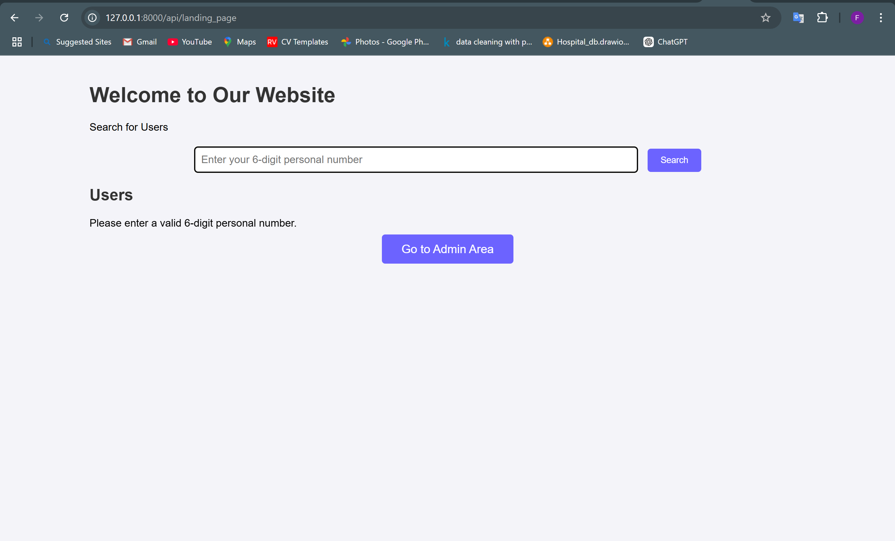
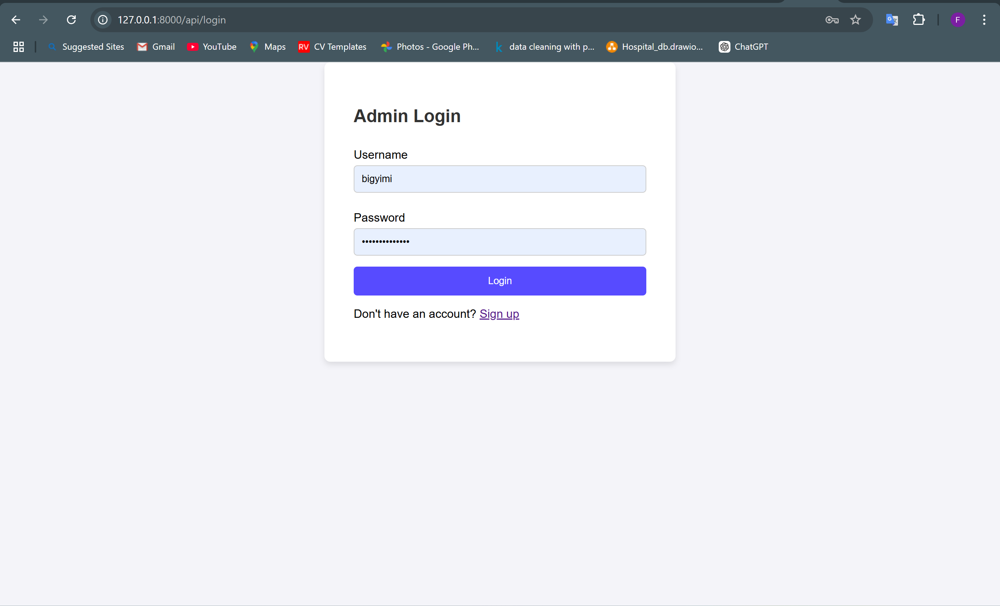
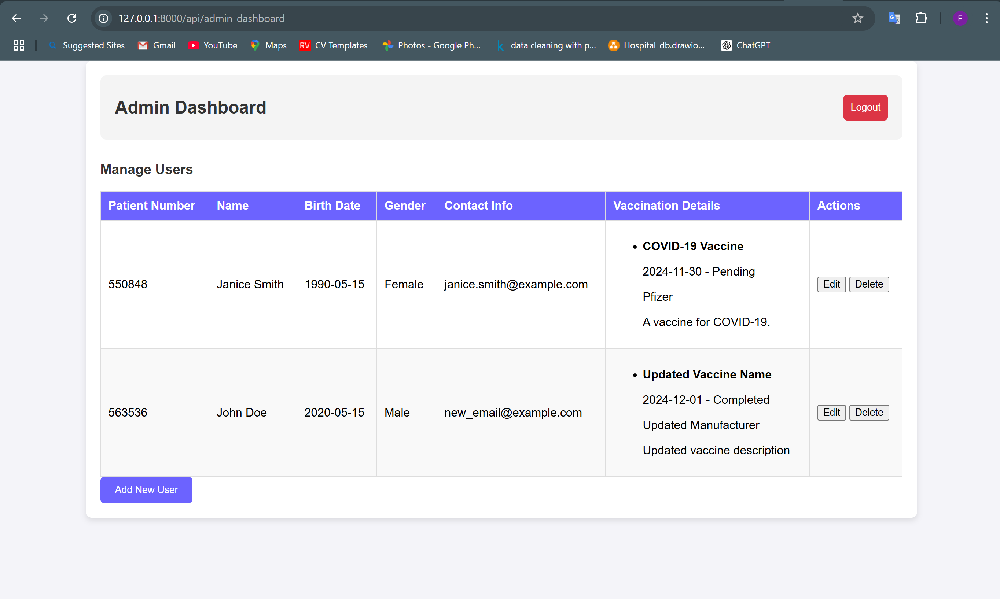
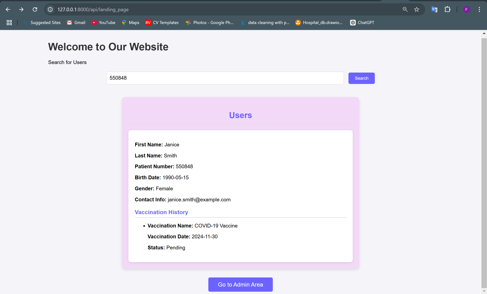

### Documentation for Admin Dashboard Application

---

### **Overview**
The Admin Dashboard application is a web-based platform designed to manage user data and vaccination details. It includes features for creating, reading, updating, and deleting (CRUD) user records, as well as managing vaccination information. 

The application is built using the **Django framework** for the backend, with a **RESTful API** to handle data operations, and uses **HTML, CSS, and JavaScript** for the frontend.

---

### **Tools and Technologies Used**

#### **Backend**
1. **Django**
   - Framework used to build the application backend.
   - Provides APIs for creating and managing user and vaccination data.

2. **Django REST Framework (DRF)**
   - Facilitates the creation of RESTful APIs to connect the frontend and backend.
   - Endpoints:
     - `http://127.0.0.1:8000/api/retrieveindividuals/` - Fetch all users and their vaccination details.
     - `http://127.0.0.1:8000/api/individual/{patient_number}/` - Fetch specific user data.
     - `http://127.0.0.1:8000/api/admin/update/{patient_number}/` - Update a user's details.
     - `http://127.0.0.1:8000/api/admin/delete/{patient_number}/` - Delete a user record.
     - `http://127.0.0.1:8000/api/individual_with_vaccination/` - Add a new user with vaccination details.

3. **Mysql** (default Django database)
   - Stores user and vaccination data.

#### **Frontend**

1. **HTML**
   - Used to structure the web pages for the application.

2. **CSS**
   - Enhances the design and layout of the application.
   - Static files are served from the `static/css/styles.css` directory.

3. **JavaScript**
   - Handles dynamic operations such as form submission, data fetching, and displaying user data.
   - Manages interactions like editing and deleting user records without reloading the page.

---

### **Features**
1. **User Management**
   - Add new users via a form.
   - View all users in a table format.
   - Edit user details dynamically.
   - Delete user records.
   - Search Users. 

2. **Vaccination Management**
   - View and update vaccination history for users.
   - Input details such as vaccination name, manufacturer, and description.

3. **Authentication**
   - Includes a separate admin sign-up page and login page for authentication.

4. **CRUD Operations**
   - Easily perform create, read, update, and delete operations via intuitive UI and API.

---

### **How to Start and Use the Application**

#### **Pre-Requisites**
1. Install Python (version 3.8+ recommended).
2. Install `pip` (Python package manager).
3. Install Django and Django REST Framework:
   ll django djangorestframework
4. A text editor/IDE like Visual Studio Code.

#### **Setup Steps**
1. Clone or download the project files into your local machine.
2. Navigate to the project directory:
   ```bash
   cd project_directory
   ```
3. Apply migrations to set up the database:
   ```bash
   python manage.py makemigrations
   python manage.py migrate
   ```

4. Start the Django development server:
   ```bash
   python manage.py runserver
   ```

#### **Access the Application**
- Open your browser and go to `http://127.0.0.1:8000/`.
- For admin access, navigate to `http://127.0.0.1:8000/admin/` and log in with your superuser credentials.

#### **Usage**
1. **Sign-Up/Sign-In**
   - Admins can create accounts using the "Create Admin Account" form.
   - Login credentials are verified, and users are redirected to the dashboard.

2. **Dashboard**
   - View all users in a table format.
   - Use the **Add New User** button to open the form and input details.
   - Use the **Edit** button to modify user data dynamically.
   - Use the **Delete** button to remove a user record permanently.

3. **Logout**
   - Click the logout button in the header to return to the login screen.

---

### **APIs**
- All API endpoints handle JSON data.
- Example JSON payload for adding a new user:
  ```json
  {
      "individual": {
          "first_name": "John",
          "last_name": "Doe",
          "birth_date": "1980-01-01",
          "gender": "Male",
          "contact_info": "john.doe@example.com"
      },
      "vaccination": {
          "vaccination_name": "COVID-19 Vaccine",
          "manufacturer": "Pfizer",
          "description": "Two doses completed."
      }
  }
  ```

---

### **Troubleshooting**
1. **Database Errors**
   - Ensure migrations are applied correctly.
   - Check for database integrity errors.

2. **API Errors**
   - Test API endpoints using tools like **Postman**.
   - Verify endpoint paths and request payloads.


---

By following the setup and usage instructions, you can efficiently manage user data and vaccination records with this application.





